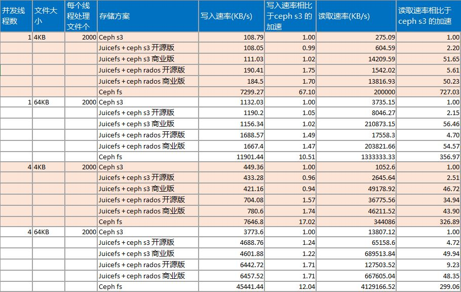

#### 一、Tensorflow 训练任务读取样本加速效果测试  
测试数据：

| 数据来源	| 读取样本耗时（秒）	| 读取样本速率 （条/秒）|	相比 ceph s3加速倍数 |
| --- | --- | --- | --- |
| Ceph s3	|91.56	|1118.37 |	1 |
|Juicefs + ceph s3 开源版	| 21.80 |	4696.51 |	4.2 |
| Juicefs + ceph s3 商业版 |	7.86 |	13027.02 |	11.6 |
|Juicefs + ceph rados 开源版|	18.55|	5520.33	| 4.9 |
|Juicefs + ceph rados 商业版 |	7.53	|13603.69 |	12.16 |
|Ceph fs	| 8.21 |	12472.6	| 11.15 |

测试结论：
1. 相比于直接读ceph s3，开源版本juice fs 有4-5倍左右加速；商业版本有10倍左右加速
2. 读juice fs 商业版 和读 ceph fs 速度接近
3. Juice fs + ceph rados 比 juice fs + ceph s3 更快一些，10-20%左右加速
	
由于任务测试，读取数据间隙会进行tensorflow训练，因此速度未达到极限。所以进行了读写压力测试。

#### 二、压力测试  
测试代码： https://github.com/gtarcoder/foo-go/blob/main/internal/tools/fs_benchmark.go  
测试数据：  

测试结论：  
1. 写入速率
   a. juicefs 商业版本性能和开源版本速率接近，且和直接写 ceph s3速率接近（偶尔会低于ceph s3) 
   b. juicefs + rados 写入速率是 juicefs + s3 的大概1.5 倍  
   c. ceph fs 远优于其他方案，速率大概是直接写ceph s3的 10-60 倍
2. 读取速率  
   a. juice fs 商业版本性能比开源版本快大概20倍，juicefs 开源版本比直接读 ceph s3 快2-4倍  
   b. juice fs 开源版本 juicefs + rados 速度大概是 juicefs + s3 的2-3倍  
   c. Juice fs 商业版本 juicefs + rados 速度和juicefs + s3 接近  
   d. Ceph fs 远优于其他方案，速度是直接读 ceph s3 的300-700 倍